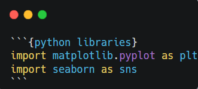
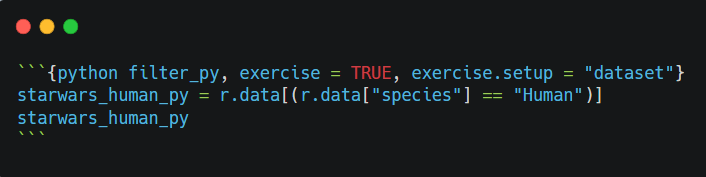
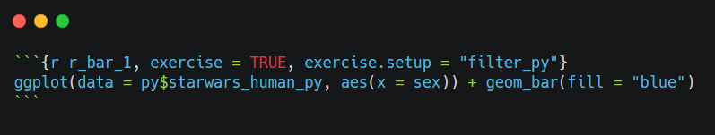
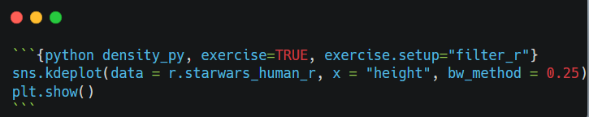

## 1. Set up Python in RStudio

Set a default Python interpreter in the RStudio IDE Global.

```{r, echo=FALSE, out.width="100%", fig.align="center"}
 
```

## 2. Import libraries

### Load R libraries

```{r setup, includ =TRUE, warning=FALSE, message=FALSE}
library(learnr)
library(reticulate)
library(tidyverse)
knitr::opts_chunk$set(echo = TRUE)
```

### Import Python libraries

```{r, echo=FALSE, out.width="40%", fig.align="center"}
 
```

```{python libraries}
import matplotlib.pyplot as plt
import seaborn as sns
```

## 3. Load data

```{r dataset, exercise=TRUE}
data <- starwars
```

## 4. Filter data

### Filter data in R

```{r filter_r, exercise=TRUE, exercise.setup="dataset"}
starwars_human_r <- data %>%
  filter(species == "Human")
starwars_human_r
```

### Filter data in Python

```{r, echo=FALSE, out.width="100%", fig.align="center"}
 
```

```{python filter_py, exercise=TRUE, exercise.setup="dataset"}
starwars_human_py = r.data[(r.data["species"] == "Human")]
starwars_human_py
```

## 5. Visualize data

### Create a barplot in R

Let’s make a barplot graph of the sex for the human species in the starwars data.

```{r, echo=FALSE, out.width="60%", fig.align="center"}
 
```

```{r r_bar_1, exercise=TRUE, exercise.setup="filter_py"}
ggplot(data = py$starwars_human_py, aes(x = sex)) + geom_bar(fill = "blue")
```

Let's improve the visual by:

- Changing the theme by adding a new layer with a built-in theme `+ theme_bw()`
- Reducing the bars size by adding `width = 0.5` within `geom_bar()`

```{r r_bar_2, exercise=TRUE, exercise.setup="filter_py"}
ggplot(data = py$starwars_human_py, aes(x = sex)) + geom_bar(fill = "blue")
```

```{r r_bar_2-solution}
ggplot(data = py$starwars_human_py, aes(x = sex)) + geom_bar(width = 0.5, fill = "blue") + theme_bw()
```

### Create a density plot using matplotlib in Python

Let's create a density plot using the `matplotlib` library in Python.

```{r, echo=FALSE, out.width="60%", fig.align="center"}
 
```

```{python density_py, exercise=TRUE, exercise.setup="filter_r"}
sns.kdeplot(data = r.starwars_human_r, x = "height", bw_method = 0.25)
plt.show()
```

### Visualize the number of films of feminine character

Determine the type of the films column.

```{r class, exercise=TRUE, exercise.setup="dataset"}
class(starwars_human_r$films)
```

Let's visualize the number of films of feminine character. Complete the code.

```{r r_bar_3, exercise=TRUE, exercise.setup="dataset"}
ggplot(data = starwars_human_r %>% 
    filter(gender == "feminine") %>% 
    mutate(count_films = ____), aes(x =  name, y = count_films)) +
    geom_bar(stat = "____",fill = "blue") + theme_bw() + 
    theme(axis.text.x = element_text(angle = 30))  
```

```{r r_bar_3-solution}
ggplot(data = starwars_human_r %>% 
    filter(gender == "feminine") %>% 
    mutate(count_films = lengths(films)), aes(x =  name, y = count_films)) +
    geom_bar(stat = "identity",fill = "blue") + theme_bw() + 
    theme(axis.text.x = element_text(angle = 30))
```
